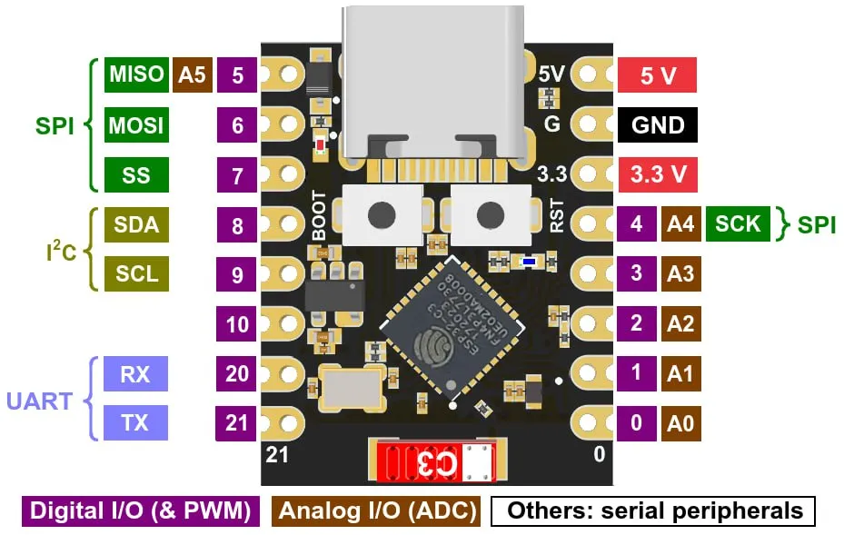
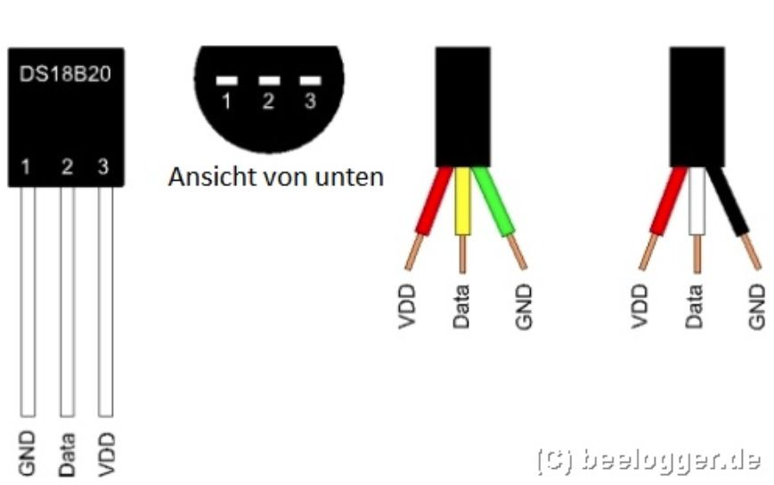

# Dom

<font color="#fc1710ff"> **Пока частично работает** !!! </font>

- Работает только начальный скетч (правилно работает).
- С Библиотека DallasTemperature и DS18b20 показывает температуру.
- 

## Соединение двух ESP32 (DEV Module & C3 Super Mini) между собой

---

- Dev Module принимает сигнал.
- Super Mini отправляет данные температуры c DS18B20 и влажности с самодельного резистивного датчика.

---
Комплектующие:

- ESP32 Dev Module (30 pin)
- ESP32C3 Super Mini
- Датчик DS18B20
- Самодельный датчик влажности, состоящий из двух кусков медной жилы 2,5 мм2.
- Dev Module
.png "ESP32")
- Super Mini

- DS18B20


Начальный скетч взят: [Руководство по ESP-NOW](https://voltiq.ru/esp-now-esp32-arduino-ide/?ysclid=lyya2i91g5994491045)

Температура: [Alex Gyver](https://alexgyver.ru/lessons/ds18b20/)

```cpp
// асинхронный опрос одного датчика на пине

#include <GyverDS18.h>
GyverDS18Single ds(4);  // пин 4

void setup() {
    Serial.begin(115200);
    ds.requestTemp();  // первый запрос на измерение
}

void loop() {
    if (ds.ready()) {         // измерения готовы по таймеру
        if (ds.readTemp()) {  // если чтение успешно
            Serial.print("temp: ");
            Serial.println(ds.getTemp());
        } else {
            Serial.println("read error");
        }

        ds.requestTemp();  // запрос следующего измерения
    }
}
```

Ещё...
[Датчик температуры Arduino DS18B20](https://arduinomaster.ru/datchiki-arduino/arduino-ds18b20/)

Библиотека DallasTemperature и DS18b20

```cpp
#include <DallasTemperature.h>

// Номер пина Arduino с подключенным датчиком
#define PIN_DS18B20 8

// Создаем объект OneWire
OneWire oneWire(PIN_DS18B20);

// Создаем объект DallasTemperature для работы с сенсорами, передавая ему ссылку на объект для работы с 1-Wire.
DallasTemperature dallasSensors(&amp;oneWire);

// Специальный объект для хранения адреса устройства
DeviceAddress sensorAddress;

void loop(void){
  // Запрос на измерения датчиком температуры

  Serial.print("Измеряем температуру...");
  dallasSensors.requestTemperatures(); // Просим ds18b20 собрать данные
  Serial.println("Выполнено");

  //  Запрос на получение сохраненного значения температуры
  printTemperature(sensorAddress);

  // Задержка для того, чтобы можно было что-то разобрать на экране
  delay(1000);
}

// Вспомогательная функция печати значения температуры для устрйоства
void printTemperature(DeviceAddress deviceAddress){
  float tempC = dallasSensors.getTempC(deviceAddress);
  Serial.print("Temp C: ");
  Serial.println(tempC);
}

// Вспомогательная функция для отображения адреса датчика ds18b20
void printAddress(DeviceAddress deviceAddress){
  for (uint8_t i = 0; i < 8; i++)
  {
    if (deviceAddress[i] < 16) Serial.print("0");
    Serial.print(deviceAddress[i], HEX);
  }
}
```
