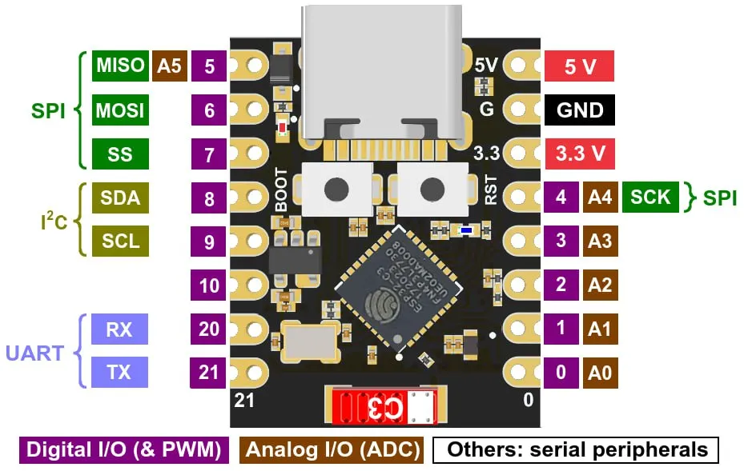

# Dom

**Пока не работает** !!!  

- Работает только начальный скетч (правилно работает).

## Соединение двух ESP32 (DEV Module & C3 Super Mini) между собой

---

- Dev Module принимает сигнал.
- C3 отправляет данные температуры и влажности с самодельного резистивного датчика.

---
Комплектующие:

- ESP32 Dev Module (30 pin)
- ESP32C3 Super Mini
- Датчик DS18B20
- Самодельный датчик влажности, состоящий из двух кусков медной жилы 2,5 мм2.
- Dev Module
.png "ESP32")
- Super Mini

- DS18B20

Начальный скетч взят [Руководство по ESP-NOW](https://voltiq.ru/esp-now-esp32-arduino-ide/?ysclid=lyya2i91g5994491045)
